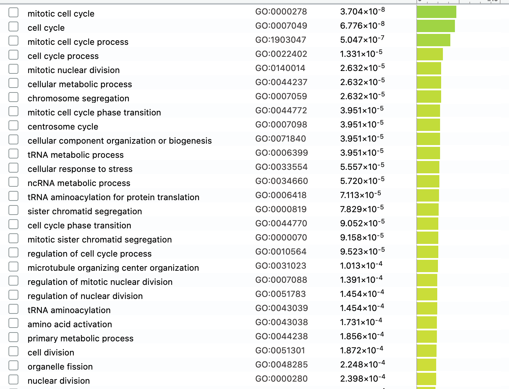

* Michael Wong
* Student#: 1003546692
* Data source: GSE129806

## Install necessary packages..


```{r}
if (!requireNamespace("BiocManager", quietly = TRUE))    
  install.packages("BiocManager")
if (!requireNamespace("GEOmetadb", quietly = TRUE))    
  BiocManager::install("GEOmetadb")
if (!requireNamespace("edgeR", quietly = TRUE))
  BiocManager::install("edgeR")
if (!requireNamespace("ggplot2", quietly = TRUE))
  install.packages("ggplot2")
if (!requireNamespace("reshape2", quietly = TRUE))
  BiocManager::install("reshape2")
if (!requireNamespace("HGNChelper", quietly = TRUE))
  BiocManager::install("HGNChelper")
if (!requireNamespace("limma", quietly = TRUE))
  BiocManager::install("limma")
if (!requireNamespace("knitr", quietly = TRUE))
  BiocManager::install("knitr")
if (!requireNamespace("ComplexHeatmap", quietly = TRUE))
  install.packages("ComplexHeatmap")
if (!requireNamespace("circlize", quietly = TRUE))
  install.packages("circlize")
if (!requireNamespace("Biobase", quietly = TRUE))
  BiocManager::install("Biobase")
```

## Select an Expression Data Set.

Get the data for my chosen GEO id. I chose to work with the data set from an experiment that uses RNA-sequencing to study stem cell derived cortical excitatory (cExN) and cortical inhibitory (cIN) neurons from three individuals with varying affectation of autism syndrome disorder (ASD) (Lewis, Meganathan and Baldridge 2019).
```{r}
myGEOID <- 'GSE129806'
suppFiles = GEOquery::getGEOSuppFiles(myGEOID)
```

This portion summarizes the data preprocessing and normalziation steps we did in assignment 1.
```{r}
fileNames = rownames(suppFiles)
data <- read.delim(fileNames[2], check.names=FALSE, header=TRUE)
colnames(data)[1] <- 'gene_id'
na.omit(data)
# Remove dates from excel errors
data <- data[!grepl('^[0-9]{1,2}[-][a-zA-Z]{3}$', data$gene_id),]
rownames(data) <- data$gene_id
replacements <- HGNChelper::checkGeneSymbols(data$gene_id)
# Update the gene id with the newest HGNC symbols if available
data$gene_id <- ifelse(!replacements$Approved & !is.na(replacements$Suggested.Symbol), replacements$Suggested.Symbol, replacements$x)
# Calculate CPM
cpms = edgeR::cpm(data[,3:34])
rownames(cpms) <- data[,1]
# Remove low counts
keep = rowSums(cpms > 1) >= 3
data_filtered = data[keep,]
rows_removed = dim(data)[1]-dim(data_filtered)[1]
# Based on code from lecture 4
samples <- data.frame(lapply(colnames(data)[3:34], FUN=function(x){unlist(strsplit(x, split="_"))[c(1,2)]}))
colnames(samples) = colnames(data)[3:34]
rownames(samples) = c("patients", "cell_type")
samples <- data.frame(t(samples))

# Based on code from lecture 4
data_filtered_matrix <- as.matrix(data_filtered[,3:34])
rownames(data_filtered_matrix) <- data_filtered$gene_id
d = edgeR::DGEList(counts=data_filtered_matrix, group=samples$cell_type)
d = edgeR::calcNormFactors(d)
normalized_counts <- edgeR::cpm(d)
```

## Differential Gene Expression
The purpose of this section is to conduct differential expression analysis and rank genes with the normalized expression set from assignment 1.

### Summary of Assignment 1
In assignment 1, we downloaded the data set of interest. The data set is from an experiment that uses RNA-sequencing to study stem cell derived cortical excitatory (cExN) and cortical inhibitory (cIN) neurons from three individuals with varying affectation of autism syndrome disorder (ASD) (Lewis, Meganathan and Baldridge 2019). To explore the data, the null values, mistakes (dates instead of genes) and outliers were removed. The data was then normalized using TMM normalization. The pre-normalization and post-normalization data was graphed out using boxplots and density curves.

### Plot MDS
From the MDS plot we can see two things. One is the significant dissimilarity between the two cell types. In dark green we have the cortical inhibitory neuron cells and in the blue we have the cortical excitatory neuron cells. As well we can see the that both cell types of the affected proband (AP) are clustered near the top. Both cell types of the mother (UM) and sibling (IS) of the affected proband are clustered near the middle and the unaffected control cell types are clustered near the bottom. Since we're interested in seeing which genes may be attributed to autism syndrome disorder, we'll focus our analysis on which patient (UM, IS, AP or UC) the cells come from.

```{r}
limma::plotMDS(d, labels=rownames(samples), col = c("darkgreen", "blue")[factor(samples$cell_type)])
```

### Produce heat map from normalized data
```{r}
# Take a look at the normalized data from the previous assignment
knitr::kable(normalized_counts[1:5, 1:5], type="html")
```

```{r}
# Based off lecture notes

# Convert it to a number matrix
heatmap_matrix <- as.matrix(normalized_counts)
# Scale and centre each row around the mean
heatmap_matrix <- t(scale(t(heatmap_matrix)))

# Create the heat map
if(min(heatmap_matrix) == 0){
  heatmap_col = circlize::colorRamp2(c(0, max(heatmap_matrix)),
                                      c("white", "red"))
} else {
  heatmap_col = circlize::colorRamp2(c(min(heatmap_matrix), 0,
                                       max(heatmap_matrix)), c("blue", "white", "red"))
}
current_heatmap <- ComplexHeatmap::Heatmap(as.matrix(heatmap_matrix),
                                           show_row_dend = TRUE, show_column_dend = TRUE,
                                           col=heatmap_col, show_column_names = TRUE, show_row_names = FALSE,
                                           show_heatmap_legend = TRUE)
# Takes a while to run
current_heatmap
```

### Use MDS Plot to view clusters in data.
Now we want to plot the MDS using limma R package. We can tell there are 3 distinct clusters. The cluster to the top left show the cIN neuron cells which all have similar logFC dim1 and dim2 scores. The cluster to the top right shows the affected proband, unaffected mother and intermediate sibling cExN cells, which are distinct from the unaffected control cExN cells. This is useful because we want to see analyze the gene expression in cells from patients with autism syndrome disorder or their relatives.
```{r}
limma::plotMDS(heatmap_matrix, col = rep(c("darkgreen", "blue"), 10))
```

To see the data in a different perspective, we can colour by patient and do another MDS plot. We can see that relateively, clustering for patients is better in the cIN cells than the cExN cells. Once again we see that there is significant difference between the gene expression of UC cExN cells and the gene expression of the other 3 patient cells.
```{r}
# Based off lecture notes
pat_colors <- rainbow(4)
pat_colors <- unlist(lapply(pat_colors,FUN=function(x){rep(x,4)}))
limma::plotMDS(heatmap_matrix, col = pat_colors)
```

### Model Design
For the next step, we want to create a model matrix and fit the data we have into it. We will focus on using the patient column for analysis since we want to understand differential expression of genes in patients with or related to someone with autism and patients without autism.

```{r}
# Set model to patients
model_design <- model.matrix(~ samples$patients)
```


To calculate p-values we will use the limma method.
```{r}
# Based off lecture notes

# There was an error citing duplicate row names. We will use make.names to make them unique.
rownames(normalized_counts) = make.names(rownames(normalized_counts), unique=TRUE)

# Calculate expression matrix and minimal set
expression_matrix <- as.matrix(normalized_counts)
minimal_set <- Biobase::ExpressionSet(assayData=expression_matrix)

# Fit the data
fit <- limma::lmFit(minimal_set, model_design)
fit2 <- limma::eBayes(fit,trend=TRUE)

topfit <- limma::topTable(fit2,
                          coef=ncol(model_design),
                          adjust.method = "BH",
                          number = nrow(expression_matrix))
output_hits <- merge(rownames(normalized_counts),
                     topfit,
                     by.y=0, by.x=1,
                     all.y=TRUE)
output_hits <- output_hits[order(output_hits$P.Value),]
# Take a look at the top 10 hits
knitr::kable(output_hits[1:10,], type="html")
```

```{r}
output_hits
```

From the results we can see that 2499 genes had a P value < 0.05.
```{r}
length(which(output_hits$P.Value < 0.05))
```

Once corrected, that number goes down to 714 genes.
```{r}
simple_adj_p_values <- length(which(output_hits$adj.P.Val < 0.05))
simple_adj_p_values
```

We graph the p-values to see if we have any potential problems. The graph shows that we have a set of good p-values since the bins are highly right skewed and not uniformly distributed.

```{r}
ggplot2::ggplot(output_hits, ggplot2::aes(x=P.Value)) +
  ggplot2::geom_histogram() +
  ggplot2::labs(title="P values", y="counts", x="p-value")
```

### Multiple Hypothesis Correction
We now want to improve our results and account for the variability seen in different patients and cell types. We'll create a design matrix that accounts for both cell type and patient.

```{r}
model_design_ct <- model.matrix(~ samples$cell_type + samples$patients)
```

Now we repeat the previous step of fitting the data to our new model.
```{r}
# Based off lecture notes
fit_ct <- limma::lmFit(minimal_set, model_design_ct)
fit_ct2 <- limma::eBayes(fit_ct,trend=TRUE)

topfit_ct <- limma::topTable(fit_ct2,
                          coef=ncol(model_design_ct),
                          adjust.method = "BH",
                          number = nrow(expression_matrix))
output_hits_ct <- merge(rownames(normalized_counts),
                     topfit_ct,
                     by.y=0, by.x=1,
                     all.y=TRUE)
output_hits_ct <- output_hits_ct[order(output_hits_ct$P.Value),]
# Take a look at the top 10 hits
knitr::kable(output_hits_ct[1:10,], type="html")

```

Again take a look at the p-values.
From the results we can see that 5682 genes had a P value < 0.05.
```{r}
length(which(output_hits_ct$P.Value < 0.05))
```

Once corrected, that number goes down to 3171 genes.
```{r}
complex_adj_p_values <- length(which(output_hits_ct$adj.P.Val < 0.05))
complex_adj_p_values
```

We graph the p-values to see if we have any potential problems. Again, the graph shows that we have a set of good p-values since the bins are highly right skewed and not uniformly distributed.

```{r}
ggplot2::ggplot(output_hits_ct, ggplot2::aes(x=P.Value)) +
  ggplot2::geom_histogram() +
  ggplot2::labs(title="P values", y="counts", x="p-value")
```

### Model selection
Now I want to compare the two models I have. Simple model refers to the model that considers patient only while complex model refers to the model with patient and cell type.

```{r}
# Based off lecture notes
simple_model_pvalues <- data.frame(gene_id = output_hits$x, simple_pvalue = output_hits$P.Value)

complex_model_pvalues <- data.frame(gene_id = output_hits_ct$x, complex_pvalue = output_hits_ct$P.Value)

two_models_pvalues <- merge(simple_model_pvalues, complex_model_pvalues, by.x=1, by.y=1)

two_models_pvalues$colour <- "black"
two_models_pvalues$colour[two_models_pvalues$simple_pvalue<0.05] <- "orange"
two_models_pvalues$colour[two_models_pvalues$complex_pvalue<0.05] <- "blue"
two_models_pvalues$colour[two_models_pvalues$simple_pvalue<0.05 &  two_models_pvalues$complex_pvalue<0.05] <- "red"


plot(two_models_pvalues$simple_pvalue, two_models_pvalues$complex_pvalue, col = two_models_pvalues$colour, xlab = "simple model p-values", ylab ="Complex model p-values", main="Simple vs Complex Limma")
legend("topleft", inset=0.1, legend=c("Simple", "Complex", "Both", "Not Significant"), 
       fill = c("orange", "blue", "red", "black"))
```

In the above plot, we can see that the simple model which considers patients only has a better fit to the p-values of both models.


We want to include the FMR1 gene in the plot which is an important gene for autism syndrome disorder.

```{r}
# Based off lecture notes
two_models_pvalues$colour <- "grey"
two_models_pvalues$colour[two_models_pvalues$gene_id == "FMR1"] <- "red"
plot(two_models_pvalues$simple_pvalue, two_models_pvalues$complex_pvalue, col = two_models_pvalues$colour, xlab = "Simple model p-values", ylab ="Complex model p-values", main="Simple vs Complex Limma")
points(two_models_pvalues[which(two_models_pvalues$gene_id == "CHCHD2"), 2:3], pch=2, col="red", cex=0.8 )
legend("topleft", inset=0.1, legend=c("FMR1", "rest"), 
       fill = c("red", "grey"), cex=0.7)
```
Now, we will graph a heatmap for the top hits in the model.
```{r}
# Based off lectures
top_hits <- output_hits$x[output_hits$P.Value < 0.01]
heatmap_matrix_top_hits <- t(scale(t(heatmap_matrix[which(rownames(heatmap_matrix) %in% top_hits),])))

# Do a heatmap for cIN cells
heatmap_matrix_top_hits_cIN <- heatmap_matrix[, grep(colnames(heatmap_matrix_top_hits), pattern = "cIN")]

if(min(heatmap_matrix_top_hits_cIN) == 0) {
  heatmap_col = circlize::colorRamp2(c(0, max(heatmap_matrix_top_hits_cIN)),
                                     c("white", "red"))
} else {
  heatmap_col = circlize::colorRamp2(c(min(heatmap_matrix_top_hits_cIN), 0, max(heatmap_matrix_top_hits_cIN)), c("blue", "white", "red"))
}

current_heatmap_cIN <- ComplexHeatmap::Heatmap(as.matrix(heatmap_matrix_top_hits_cIN),
                                           cluster_rows = TRUE, show_row_dend = FALSE,
                                           col=heatmap_col, show_column_names = TRUE,
                                           show_row_names = FALSE, show_heatmap_legend = TRUE)
current_heatmap_cIN
```

From the cIN cells it is difficult to distinguish clusters that are significantly different.

```{r}
# Do a heatmap for cExN cells
heatmap_matrix_top_hits_cExN <- heatmap_matrix[, grep(colnames(heatmap_matrix_top_hits), pattern = "cExN")]

if(min(heatmap_matrix_top_hits_cExN) == 0) {
  heatmap_col = circlize::colorRamp2(c(0, max(heatmap_matrix_top_hits_cExN)),
                                     c("white", "red"))
} else {
  heatmap_col = circlize::colorRamp2(c(min(heatmap_matrix_top_hits_cExN), 0, max(heatmap_matrix_top_hits_cExN)), c("blue", "white", "red"))
}

current_heatmap_cExN <- ComplexHeatmap::Heatmap(as.matrix(heatmap_matrix_top_hits_cExN),
                                           cluster_rows = TRUE, show_row_dend = FALSE,
                                           col=heatmap_col, show_column_names = TRUE,
                                           show_row_names = FALSE, show_heatmap_legend = TRUE)
current_heatmap_cExN
```

From the cExN cells it is easier to distinguish clusters that are significantly different. The UC cells have brighter blues and brighter reds near the middle. As well, for the 3 members of the affected proband's family, the  top part is more red, while the for the control, it is more blue. Comparing the unaffected mother to the intermediate sibling and affected proband, we see clusters of of darker blue near the top in the mother, but not in the affected proband and intermediate sibling.


Using a volcano plot we can see 
```{r}
volcano_plot <- cbind(output_hits$logFC, -log10(output_hits$P.Val))
colnames(volcano_plot) <- c("logFC", "-log10(adjusted p-value)")
rownames(volcano_plot) <- output_hits$x
plot_colours <- ifelse(output_hits$logFC < 0 & output_hits$P.Val<0.05, "red", ifelse(output_hits$logFC > 0 & output_hits$P.Val < 0.05, "blue", "black"))
plot(volcano_plot, pch = 8, xlim = c(-100, 100), col = plot_colours, cex = 0.05, main = "log2FC vs -log10(adjusted p-value) Graph")
# Genes from paper that are involved in behavior and developmental disorders
points(volcano_plot[c("CHCHD2", "CHL1", "GAS7", "S100A6"),], pch=6, 
       col=c("orange", "green", "darkblue", "purple"), cex=1 )

legend("topleft", inset=0.1, legend=c("Significantly Underexpressed", "Significantly Overexpressed", "Not Significant"), 
       fill = c("red", "blue", "black"), cex=0.7)
```

The volcano graph above shows the genes that are upregulated in blue and downregulated in red. It tells us the distribution of the upregulated vs downregulated. We can see 4 genes mentioned in the paper related to behavior and developmental disorders. 2 of them, GAS7 and S100A6 are overly expressed and 2 of them, CHCHD2 and CHL1 are under expressed (Lewis et al. 2019).


#### Question 1:
There were `r simple_adj_p_values` genes that were differentially expressed for the simple model considering patient type. There were `r complex_adj_p_values` genes that were differentially expressed for complex model considering both patient type and cell type. I used the p-value of 0.05 since that is the most common p-value widely accepted.

#### Question 2:
I chose to use the Benjamini-Hochberg method because it is straightforward and intuitive to use. As well since there are over 20,000 genes to consider, the false discovery rate can cause many false positives. The Benjamini-Hochberg test helps with reducing false positive rate, it in turns help reeduces the number of false positives in my model.

#### Question 3
See volcano plot above.

#### Question 4
See heatmaps above.


## Thresholded over-representation analysis

We see there are 1259 genes up regulated.
```{r}
length(which(output_hits$P.Value < 0.05 & output_hits$logFC > 0))
```

We see there are 1240 genes down regulated.
```{r}
length(which(output_hits$P.Value < 0.05 & output_hits$logFC < 0))
```

We want to write these genes to a file so we can do over-representation analysis.
```{r}
output_hits_to_write <- output_hits
# underexpressed genes
underexpressed_genes <- output_hits$x[which(output_hits$P.Value < 0.05 & output_hits$logFC > 0)]
# overexpressed genes
overexpressed_genes <- output_hits$x[which(output_hits$P.Value < 0.05 & output_hits$logFC < 0)]
# all genes
all_genes <- output_hits$x[which(output_hits$P.Value < 0.05 & (output_hits$logFC > 0 | output_hits$logFC < 0))]

# write to files
write.table(x=underexpressed_genes, file="upregulated_genes.txt", sep= "\t", row.names = FALSE, col.names = FALSE, quote = FALSE)
write.table(x=overexpressed_genes, file="downregulated_genes.txt", sep= "\t", row.names = FALSE, col.names = FALSE, quote = FALSE)
write.table(x=all_genes, file="combined_genes.txt", sep= "\t", row.names = FALSE, col.names = FALSE, quote = FALSE)
```

Now, we'll use the G-profiler tool to do our over-representation analysis.

#### Question 1
I chose this tool since it's been introduced to me as a homework asssignment and I'm familiar with it. Furthermore, it's constantly updated and has connections to several different databases.

#### Question 2
I chose to use the GO Biological Processes, Wiki pathways and Reactome as introduced in the homework assignment. These are all databases that have been recently updated (February 2021 for Go, March 2021 for Wiki pathways, December 2020 for Reactome) based on information provided at their websites.

#### Question 3
For upregulated genes, 0 genesets from GO:BP, 15 genesets from Reactome, 2 genesets from WP were returned. For downregulated genes, 163 genesets from GO:BP, 34 genesets from Reactome, 9 gensets from WP were returned. For combined genes, 71 genesets from GO:BP, 23 genesets from Reactome, 5 genesets from WP were returned. I used threshold 0.05 with Benjamini-Hochberg for all 3 queries as this is the commonly accepted p-value.

#### Question 4
Looking at the results I see that there were very few results returned for upregulated genes, more values returned for combined upregulated and downregulated genes and the most values returned for downregulated genes. This suggests that autism syndrome disorder (ASD) is correlated with the downregulation of many genes. 



The genesets for downregulated genes suggests correlation in mitotic processes and cell cycle. This makes sense as ASD involves disruption of cell proliferation and differentiation


The genesets for upregulated genes are few, but 7q11.23 copy number variation syndrome is known to be associated with ASD (Sanders et al. 2011)


The combination of both downregulated and upregulated genes appear to correlate to metabolic process, which I don't think is strongly correlated with ASD

## Intepretation

#### Question 1
Yes, the original paper found altered expression of genes related to cell proliferation and growth. In *Figure_1*, we also found genesets correlated to mitotic processes and cell cycles, which is related to cell profileration and growth. This suggests that the downregulated genes is associated with ASD.

#### Question 2
Yes, in *Figure_2* there is the geneset of 7q11.23 copy number variation, which is found to be associated with ASD in another paper (Sanders et al. 2011). Also, in another paper found brain maldevelopment which increases risk of ASD has a mechanism involving altered reuglation of the mitotic cycle (Pramparo et al. 2015).

## References
* Lewis, E.M.A., Meganathan, K., Baldridge, D. et al. Cellular and molecular characterization of multiplex autism in human induced pluripotent stem cell-derived neurons. Molecular Autism 10, 51 (2019). https://doi.org/10.1186/s13229-019-0306-0
* Robinson, M.D., Oshlack, A. A scaling normalization method for differential expression analysis of RNA-seq data. Genome Biol 11, R25 (2010). https://doi.org/10.1186/gb-2010-11-3-r25
* Martin Morgan (2019). BiocManager: Access the Bioconductor Project Package Repository. R package version 1.30.10. https://CRAN.R-project.org/package=BiocManager
* Zhu Y, Davis S, Stephens R, Meltzer PS, Chen Y. GEOmetadb: powerful alternative search engine for the Gene Expression Omnibus. Bioinformatics. 2008 Dec 1;24(23):2798-800. doi:10.1093/bioinformatics/btn520. Epub 2008 Oct 7. PubMed PMID: 18842599; PubMed Central PMCID:
  PMC2639278.
* Levi Waldron and Markus Riester (2019). HGNChelper: Identify and Correct Invalid HGNC Human Gene Symbols and MGI Mouse Gene Symbols. R package version 0.8.1. https://github.com/waldronlab/HGNChelper
* H. Wickham. ggplot2: Elegant Graphics for Data Analysis. Springer-Verlag New York, 2016.
* Hadley Wickham (2007). Reshaping Data with the reshape Package. Journal of Statistical Software, 21(12), 1-20. URL http://www.jstatsoft.org/v21/i12/.
* Robinson MD, McCarthy DJ and Smyth GK (2010). edgeR: a Bioconductor package for differential expression analysis of digital gene expression data. Bioinformatics 26, 139-140
* McCarthy DJ, Chen Y and Smyth GK (2012). Differential expression analysis of multifactor RNA-Seq experiments with respect to biological variation. Nucleic Acids Research 40, 4288-4297
* Gu Z, Eils R, Schlesner M (2016). “Complex heatmaps reveal patterns and correlations in multidimensional genomic data.” Bioinformatics.
* Gu Z, Gu L, Eils R, Schlesner M, Brors B (2014). “circlize implements and enhances circular visualization in R.” Bioinformatics, 30, 2811-2812.
* Huber W, Carey VJ, Gentleman R, Anders S, Carlson M, Carvalho BS, Bravo HC, Davis S, Gatto L, Girke T, Gottardo R, Hahne F, Hansen KD, Irizarry RA, Lawrence M, Love MI, MacDonald J, Obenchain V, Ole's AK, Pag'es H, Reyes A, Shannon P, Smyth GK, Tenenbaum D, Waldron L, Morgan M (2015). “Orchestrating high-throughput genomic analysis with Bioconductor.” Nature Methods, 12(2), 115–121. http://www.nature.com/nmeth/journal/v12/n2/full/nmeth.3252.html.
* Ritchie ME, Phipson B, Wu D, Hu Y, Law CW, Shi W, Smyth GK (2015). “limma powers differential expression analyses for RNA-sequencing and microarray studies.” Nucleic Acids Research, 43(7), e47. doi: 10.1093/nar/gkv007.
* https://reactome.org/
* http://geneontology.org/
* https://www.wikipathways.org/index.php/WikiPathways
* Sanders, S. J., Ercan-Sencicek, A. G., Hus, V., Luo, R., Murtha, M. T., Moreno-De-Luca, D., Chu, S. H., Moreau, M. P., Gupta, A. R., Thomson, S. A., Mason, C. E., Bilguvar, K., Celestino-Soper, P. B., Choi, M., Crawford, E. L., Davis, L., Wright, N. R., Dhodapkar, R. M., DiCola, M., DiLullo, N. M., … State, M. W. (2011). Multiple recurrent de novo CNVs, including duplications of the 7q11.23 Williams syndrome region, are strongly associated with autism. Neuron, 70(5), 863–885. https://doi.org/10.1016/j.neuron.2011.05.002
* Pramparo, T., Lombardo, M. V., Campbell, K., Barnes, C. C., Marinero, S., Solso, S., Young, J., Mayo, M., Dale, A., Ahrens-Barbeau, C., Murray, S. S., Lopez, L., Lewis, N., Pierce, K., & Courchesne, E. (2015). Cell cycle networks link gene expression dysregulation, mutation, and brain maldevelopment in autistic toddlers. Molecular systems biology, 11(12), 841. https://doi.org/10.15252/msb.20156108
* g:Profiler. (2020, December 15). GProfiler g:GOSt. Retrieved March 16, 2021, from https://biit.cs.ut.ee/gprofiler/gost
* BCB420 Lecture Notes by Ruth Isserlin

