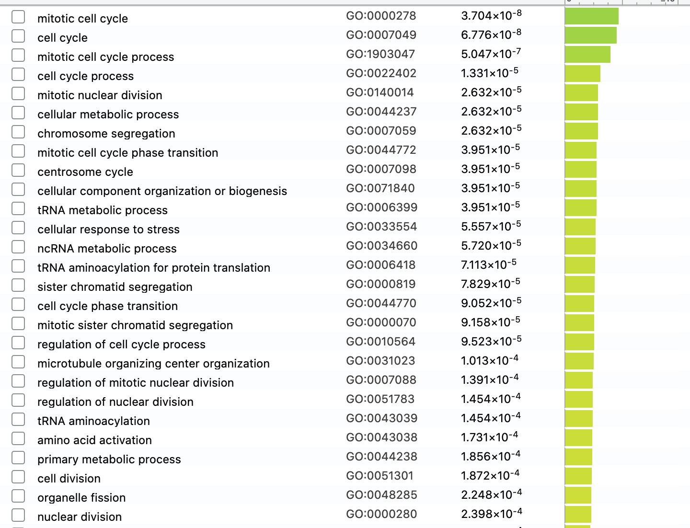
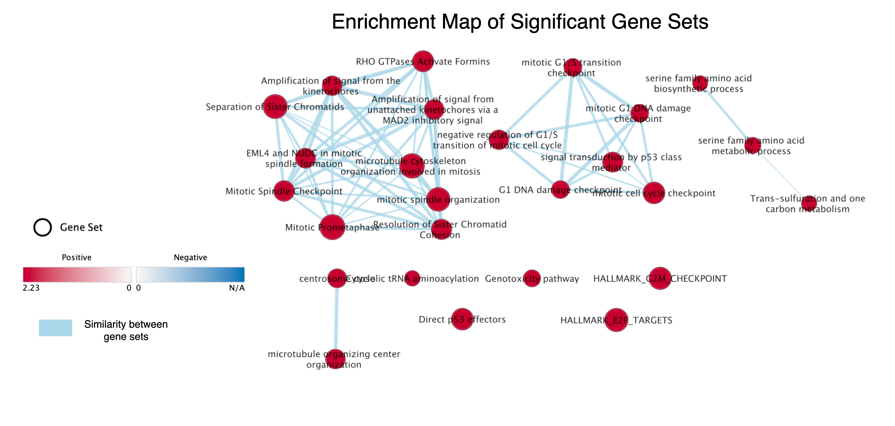
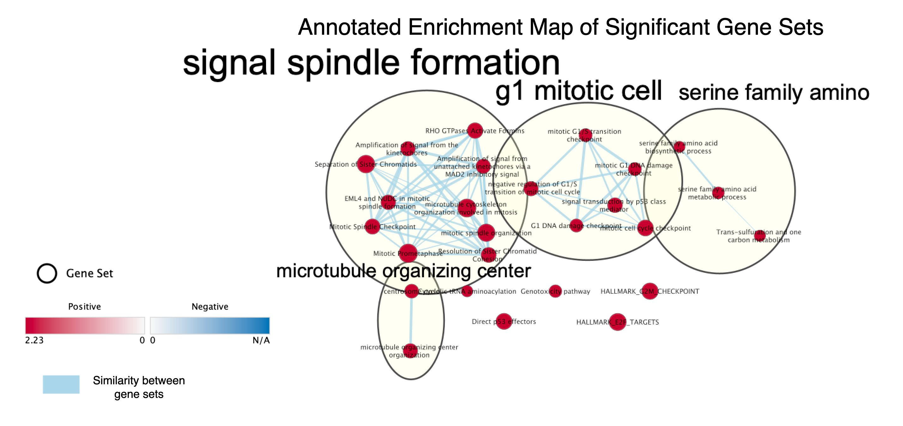
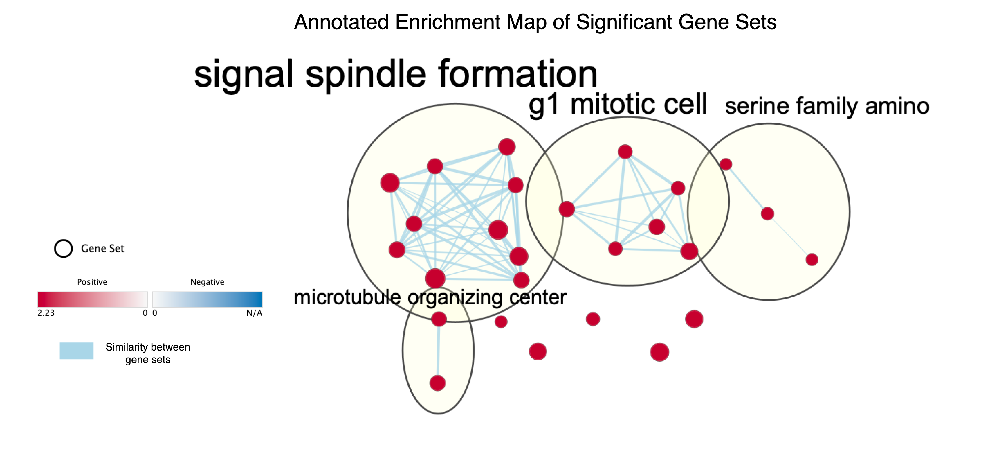
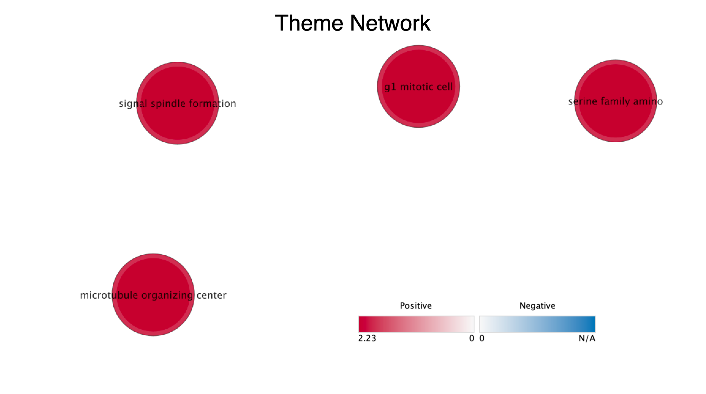
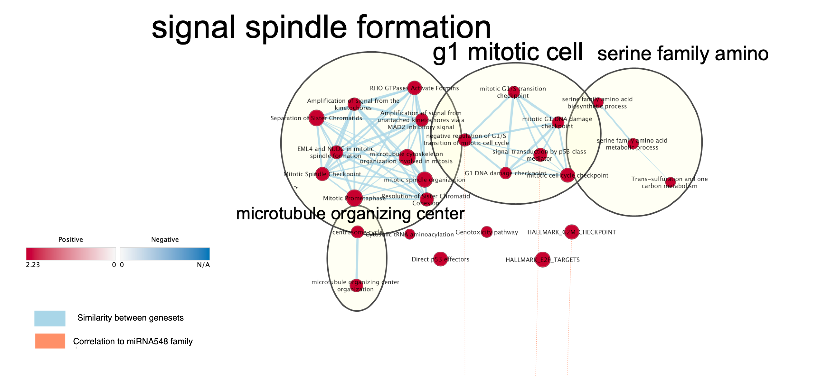

```{r setup, include=FALSE}
knitr::opts_chunk$set(echo = TRUE)
```

* Michael Wong
* Student#: 1003546692
* Data source: GSE129806

### Install the necessary libaries including those used for A1 and A2
```{r}
if (!requireNamespace("BiocManager", quietly = TRUE))    
  install.packages("BiocManager")
if (!requireNamespace("GEOmetadb", quietly = TRUE))    
  BiocManager::install("GEOmetadb")
if (!requireNamespace("edgeR", quietly = TRUE))
  BiocManager::install("edgeR")
if (!requireNamespace("ggplot2", quietly = TRUE))
  install.packages("ggplot2")
if (!requireNamespace("reshape2", quietly = TRUE))
  BiocManager::install("reshape2")
if (!requireNamespace("HGNChelper", quietly = TRUE))
  BiocManager::install("HGNChelper")
if (!requireNamespace("limma", quietly = TRUE))
  BiocManager::install("limma")
if (!requireNamespace("knitr", quietly = TRUE))
  BiocManager::install("knitr")
if (!requireNamespace("ComplexHeatmap", quietly = TRUE))
  install.packages("ComplexHeatmap")
if (!requireNamespace("circlize", quietly = TRUE))
  install.packages("circlize")
if (!requireNamespace("Biobase", quietly = TRUE))
  BiocManager::install("Biobase")
```

## A1 Summary
In A1, I chose my GEO data set based on an experiment involving human induced pluripotent stem cells of family with autism spectrum disorder (ASD). The study aims to see which genes are upregulated or downregulated in cells of patients with varying degrees of ASD vs control. I worked on normalizing the data and removing outliers for A1.


```{r}
myGEOID <- 'GSE129806'
suppFiles = GEOquery::getGEOSuppFiles(myGEOID)
fileNames = rownames(suppFiles)
data <- read.delim(fileNames[2], check.names=FALSE, header=TRUE)
colnames(data)[1] <- 'gene_id'
# Remove dates from excel errors
data <- data[!grepl('^[0-9]{1,2}[-][a-zA-Z]{3}$', data$gene_id),]
rownames(data) <- data$gene_id
replacements <- HGNChelper::checkGeneSymbols(data$gene_id)
# Update the gene id with the newest HGNC symbols if available
data$gene_id <- ifelse(!replacements$Approved & !is.na(replacements$Suggested.Symbol), replacements$Suggested.Symbol, replacements$x)
# Calculate CPM
cpms = edgeR::cpm(data[,3:34])
rownames(cpms) <- data[,1]
# Remove low counts
keep = rowSums(cpms > 1) >= 3
data_filtered = data[keep,]
rows_removed = dim(data)[1]-dim(data_filtered)[1]
# Based on code from lecture 4
samples <- data.frame(lapply(colnames(data)[3:34], FUN=function(x){unlist(strsplit(x, split="_"))[c(1,2)]}))
colnames(samples) = colnames(data)[3:34]
rownames(samples) = c("patients", "cell_type")
samples <- data.frame(t(samples))

# Based on code from lecture 4
data_filtered_matrix <- as.matrix(data_filtered[,3:34])
rownames(data_filtered_matrix) <- data_filtered$gene_id
d = edgeR::DGEList(counts=data_filtered_matrix, group=samples$cell_type)
d = edgeR::calcNormFactors(d)
normalized_counts <- edgeR::cpm(d)
```

## A2 Summary
In A2, I calcualted differential expression of the cleaned data set. I examined up-regulated genes and down-regulated genes, and used g:Profiler to find overlapping gene sets to try and understand the data.

Code summary of A2.
```{r}
model_design <- model.matrix(~ samples$patients)

# Based off lecture notes

# There was an error citing duplicate row names. We will use make.names to make them unique.
rownames(normalized_counts) = make.names(rownames(normalized_counts), unique=TRUE)

# Calculate expression matrix and minimal set
expression_matrix <- as.matrix(normalized_counts)
minimal_set <- Biobase::ExpressionSet(assayData=expression_matrix)

# Fit the data
fit <- limma::lmFit(minimal_set, model_design)
fit2 <- limma::eBayes(fit,trend=TRUE)

topfit <- limma::topTable(fit2,
                          coef=ncol(model_design),
                          adjust.method = "BH",
                          number = nrow(expression_matrix))
output_hits <- merge(rownames(normalized_counts),
                     topfit,
                     by.y=0, by.x=1,
                     all.y=TRUE)
output_hits <- output_hits[order(output_hits$P.Value),]

```

The g:Profiler results are shown below




## A3

I created a rank file from the output hits with gene symbol and rank score.

```{r}
output_hits_to_write <- output_hits

# Use signed fold change * -log10pvalue as the rank metric
output_hits_to_write$rank <- sign(output_hits_to_write$logFC) * -log10(output_hits_to_write$P.Value)
all_genes <- output_hits_to_write[order(output_hits_to_write$rank, decreasing = TRUE),]

write.table(x=data.frame(gene_id=all_genes$x, rank=all_genes$rank), file="all_genes.rnk", sep= "\t", row.names = FALSE, col.names = FALSE, quote = FALSE)
```

### Non-threshold Gene Set Enrichment Analysis

1. I will be using the javaGSEA version 4.1.0 desktop application to do my gene set enrichment analysis because of its simplicity and intuitive GUI (Subramanian et al. 2005). I downloaded the jar application and updated my Java runtime to get the app ready.

Next, I opened the app and selected the tool: Run GSEAPreranked. For the gene sets database I set it to the current Baderlab GeneSet Collection (March 01, 2021) containing GOBP data excluding GO annotations with evidence codes IEA (inferred from electronic annotation) (Merico et al. 2010).

For the GSEA process, I ran it with 1000 permutations and set max size to 200 and min size to 15.

2. The enrichment results I got from the process were:
#### Down Regulated 
3523 / 5383 gene sets are upregulated in phenotype na_pos
95 gene sets are significant at FDR < 25%
161 gene sets are significantly enriched at nominal pvalue < 1%
395 gene sets are significantly enriched at nominal pvalue < 5%

#### Up Regulated
1860 / 5383 gene sets are upregulated in phenotype na_neg
0 gene sets are significantly enriched at FDR < 25%
23 gene sets are significantly enriched at nominal pvalue < 1%
76 gene sets are significantly enriched at nominal pvalue < 5%

#### Summarized results from A2's Over Representation Analysis
Up regulated: 0 GOBP, 15 Reactome, 2 Wikipathways
Down regulated: 163 GOBP, 34 Reactome, 9 Wikipathways

3. Examining the results, I can see that similar to the Over Representation Analysis, the 
GSEA process returned significantly more gene sets for down regulated genes than up regulated
genes.

### Visualize Gene set Enrichment Analysis using Cytosacape

1. I downloaded Cytoscape 3.8.2 from the internet first. After entering the app, I proceeded to install the EnrichmentMap 3.3.1 plugin. Using the EnrichmentMap plugin, I built a heat map network using the default parameters. P-value was set to 1.0. FDR q-value cutoff for nodes was set to 0.1. Jaccard Overlap Combined was set to 0.375 (k constant = 0.5). There were 63 edges and 23 nodes in the heatmap.


2. Next, I annotated the enrichment map using the AutoAnnotate program. The paramters used for this were: Cluster Source: clusterMaker2, ClusterMaker Algorithm: MCL Cluster, Edge Attribute: EnrichmentMap::similarity_coefficient, Label Maker: WorldCloud: Adjacent Words, Max Words Per Label: 3, Word Adjacency Bonus: 8, Normalization Factor: 0.5, Attribute Names: [EnrichmentMap:GS_DESCR], Display Style: Clustered-Standard, Max Words per Cloud: 250, Cluster Cutoff: 1.0, Min Word Occurrence: 1.



#### Publication Ready Enrichment Map

3.


#### Collapsed Theme Network

4.


Looking at the theme network, I can see that there are 4 major themes of significance. The themes match the themes discussed in the paper. In the paper, they found out that in autism spectrum disorder patients, exoressions of genes related to cell growth and proliferation are affected. Similarly, in the theme network, I see that microtubule organizing center, signal spindle formation and g1 mitotic cell are all related to cell growth and proliferation.

#### Interpration and Detailed View of Results

1. The enrichment results support the results found in the analysis from assignment 2. In assignment 2, I found that significantly downregulated genes were over represented in genesets involving mitotic cell cycles, microtubule organizing center and amino acid activiation, which is similar to the themes found in the GSEA anlaysis. Different from assignment 2 is that I found specifically signal spindle formation here, but didn't find any genesets mentioning spindle formation in assignment 2.

2. To support the microtubule organizing center theme, I found a paper on how microtubule-associated proteins are affected in autistic patients (Pramparo et. al. 2015). It shows that these proteins are often downregulated in cells of patients with autism vs cells of control. In another paper, it's also been found that children with autism had lower serine levels than control, which relates to the serine family amino theme (ElBaz et al. 2014). Finally, I found a paper that looks into the link between cell cycle and autism syndrome disorder supporting the signal spindle formation and mitotic cell themes since both are important in cell division (Pramparo et al. 2015)




1. I chose to do a post analysis of the main network using microRNAs. I chose to use microRNAs because I have read studies on how miRNA could be associated with and involved in autism. Furthermore, many new research studies are targeting miRNA as a predictive tool in studying autism (Schepici et al. 2019). To do the analysis on the EnrichmentMap plugin I clicked into add signature gene sets. Then I chose load from web, and loaded the Human_miRs_MSigdb_March_01_2021_symbol.gmt file from the Baderlab database. Specifically I selected, MIR548 family of miRNA genesets from the signature gene sets section and selected the hypergeometric test with 0.05 cutoff. After I switched to my network and saw that the MIR548 family genesets were linked to the g1 mitotic cell theme and specifically the negative reguation of G1/S transition of mitotic cell cycle, signal transduction by p53 class mediator and HallMark_E2F_Targets genesets. In a study on miRNA expression in autism, it was found that miRNA548 was dsyregulated in ASD individuals and affect several genes invovled in neurodevelopment (Hicks et al. 2016). The genesets shown to have correlation with miRNA548 sets are also those that have functions in neurodevelopment.

## References
* Lewis, E.M.A., Meganathan, K., Baldridge, D. et al. Cellular and molecular characterization of multiplex autism in human induced pluripotent stem cell-derived neurons. Molecular Autism 10, 51 (2019). https://doi.org/10.1186/s13229-019-0306-0
* Robinson, M.D., Oshlack, A. A scaling normalization method for differential expression analysis of RNA-seq data. Genome Biol 11, R25 (2010). https://doi.org/10.1186/gb-2010-11-3-r25
* Martin Morgan (2019). BiocManager: Access the Bioconductor Project Package Repository. R package version 1.30.10. https://CRAN.R-project.org/package=BiocManager
* Zhu Y, Davis S, Stephens R, Meltzer PS, Chen Y. GEOmetadb: powerful alternative search engine for the Gene Expression Omnibus. Bioinformatics. 2008 Dec 1;24(23):2798-800. doi:10.1093/bioinformatics/btn520. Epub 2008 Oct 7. PubMed PMID: 18842599; PubMed Central PMCID:
  PMC2639278.
* Levi Waldron and Markus Riester (2019). HGNChelper: Identify and Correct Invalid HGNC Human Gene Symbols and MGI Mouse Gene Symbols. R package version 0.8.1. https://github.com/waldronlab/HGNChelper
* H. Wickham. ggplot2: Elegant Graphics for Data Analysis. Springer-Verlag New York, 2016.
* Hadley Wickham (2007). Reshaping Data with the reshape Package. Journal of Statistical Software, 21(12), 1-20. URL http://www.jstatsoft.org/v21/i12/.
* Robinson MD, McCarthy DJ and Smyth GK (2010). edgeR: a Bioconductor package for differential expression analysis of digital gene expression data. Bioinformatics 26, 139-140
* McCarthy DJ, Chen Y and Smyth GK (2012). Differential expression analysis of multifactor RNA-Seq experiments with respect to biological variation. Nucleic Acids Research 40, 4288-4297
* Gu Z, Eils R, Schlesner M (2016). “Complex heatmaps reveal patterns and correlations in multidimensional genomic data.” Bioinformatics.
* Gu Z, Gu L, Eils R, Schlesner M, Brors B (2014). “circlize implements and enhances circular visualization in R.” Bioinformatics, 30, 2811-2812.
* Huber W, Carey VJ, Gentleman R, Anders S, Carlson M, Carvalho BS, Bravo HC, Davis S, Gatto L, Girke T, Gottardo R, Hahne F, Hansen KD, Irizarry RA, Lawrence M, Love MI, MacDonald J, Obenchain V, Ole's AK, Pag'es H, Reyes A, Shannon P, Smyth GK, Tenenbaum D, Waldron L, Morgan M (2015). “Orchestrating high-throughput genomic analysis with Bioconductor.” Nature Methods, 12(2), 115–121. http://www.nature.com/nmeth/journal/v12/n2/full/nmeth.3252.html.
* Ritchie ME, Phipson B, Wu D, Hu Y, Law CW, Shi W, Smyth GK (2015). “limma powers differential expression analyses for RNA-sequencing and microarray studies.” Nucleic Acids Research, 43(7), e47. doi: 10.1093/nar/gkv007.
* https://reactome.org/
* http://geneontology.org/
* https://www.wikipathways.org/index.php/WikiPathways
* Sanders, S. J., Ercan-Sencicek, A. G., Hus, V., Luo, R., Murtha, M. T., Moreno-De-Luca, D., Chu, S. H., Moreau, M. P., Gupta, A. R., Thomson, S. A., Mason, C. E., Bilguvar, K., Celestino-Soper, P. B., Choi, M., Crawford, E. L., Davis, L., Wright, N. R., Dhodapkar, R. M., DiCola, M., DiLullo, N. M., … State, M. W. (2011). Multiple recurrent de novo CNVs, including duplications of the 7q11.23 Williams syndrome region, are strongly associated with autism. Neuron, 70(5), 863–885. https://doi.org/10.1016/j.neuron.2011.05.002
* Pramparo, T., Lombardo, M. V., Campbell, K., Barnes, C. C., Marinero, S., Solso, S., Young, J., Mayo, M., Dale, A., Ahrens-Barbeau, C., Murray, S. S., Lopez, L., Lewis, N., Pierce, K., & Courchesne, E. (2015). Cell cycle networks link gene expression dysregulation, mutation, and brain maldevelopment in autistic toddlers. Molecular systems biology, 11(12), 841. https://doi.org/10.15252/msb.20156108
* g:Profiler. (2020, December 15). GProfiler g:GOSt. Retrieved March 16, 2021, from https://biit.cs.ut.ee/gprofiler/gost
* BCB420 Lecture Notes by Ruth Isserlin

## References added for A3
* ElBaz F., Zaki M., Youssef A., ElDorry G., Elalfy D (2014).
"Study of plasma amino acid levels in children with autism: An Egyptian sample."
Egyptian Journal of Medical Human Genetics, 15(2). https://doi.org/10.1016/j.ejmhg.2014.02.002
* Chang, Q., Yang, H., Wang, M., Wei, H., & Hu, F. (2018). Role of Microtubule-Associated Protein in Autism Spectrum Disorder. Neuroscience bulletin, 34(6), 1119–1126. https://doi.org/10.1007/s12264-018-0246-2
* Pramparo, T., Lombardo, M. V., Campbell, K., Barnes, C. C., Marinero, S., Solso, S., Young, J., Mayo, M., Dale, A., Ahrens-Barbeau, C., Murray, S. S., Lopez, L., Lewis, N., Pierce, K., & Courchesne, E. (2015). Cell cycle networks link gene expression dysregulation, mutation, and brain maldevelopment in autistic toddlers. Molecular systems biology, 11(12), 841. https://doi.org/10.15252/msb.20156108
* Schepici, G., Cavalli, E., Bramanti, P., & Mazzon, E. (2019). Autism Spectrum Disorder and miRNA: An Overview of Experimental Models. Brain sciences, 9(10), 265. https://doi.org/10.3390/brainsci9100265
* Hicks, S. D., & Middleton, F. A. (2016). A Comparative Review of microRNA Expression Patterns in Autism Spectrum Disorder. Frontiers in psychiatry, 7, 176. https://doi.org/10.3389/fpsyt.2016.00176
* Merico, D., Isserlin, R., Stueker, O., Emili, A., & Bader, G. D. (2010). Enrichment map: a network-based method for gene-set enrichment visualization and interpretation. PloS one, 5(11), e13984. https://doi.org/10.1371/journal.pone.0013984
* Otasek, et al., Cytoscape Automation: empowering workflow-based network analysis Genome Biology, 20:185 (2019)
* Mootha, V. K., Lindgren, C. M., Eriksson, K. F., Subramanian, A., Sihag, S., Lehar, J., Puigserver, P., Carlsson, E., Ridderstrale, M., Laurila, E., et al. (2003). PGC-1alpha-responsive genes involved in oxidative phosphorylation are coordinately downregulated in human diabetes. Nat Genet 34, 267-273.
*  Subramanian, Tamayo, et al. 2005 Proc Natl Acad Sci U S A 102(43):15545-50.
